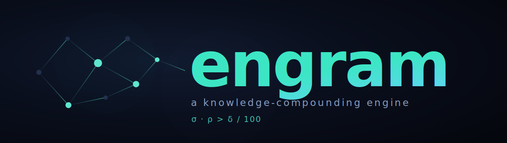
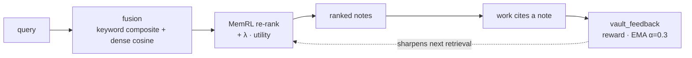
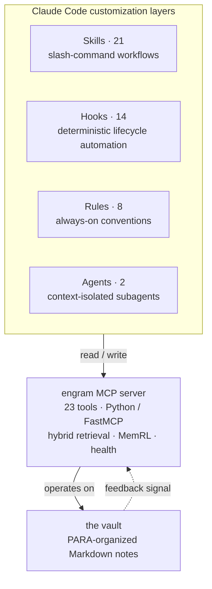

<div align="center">



<p><em>Turn an AI coding agent's transient context into a durable, self-improving knowledge base.</em></p>

[](https://github.com/alexiagnocco/engram/actions/workflows/ci.yml)
[](LICENSE)


[](https://alexiagnocco.github.io/engram/)

**[Read the documentation site&nbsp;→](https://alexiagnocco.github.io/engram/)**

</div>

---

engram pairs a Python MCP server that does **hybrid retrieval with a reinforcement-learning feedback loop** with a layered stack of skills, hooks, rules, and subagents that make an agent *retrieve before it acts, persist as it works, and learn what was actually useful*. It's a self-contained study in **agent memory** — retrieval, reinforcement learning, and orchestration — built to run on any MCP client.

The thesis in one line:

> A knowledge base compounds only when it surfaces the right things faster than it forgets them: **σ · ρ > δ / 100**.

- **σ** — retrieval *coverage*: how much of what you know you actually surface.
- **ρ** — retrieval *precision*: how useful what you surface turns out to be.
- **δ** — *decay*: how fast unused knowledge goes stale.

When `σ·ρ` exceeds `δ/100`, the system is above *escape velocity* — it accumulates useful, retrievable knowledge faster than it loses it. Every layer in engram exists to push one of those terms in the right direction.

> **Credit:** this compounding model — the equation, *escape velocity*, and the σ/ρ/δ terms — is adapted from [AgentOps · *The Science*](https://boshu2.github.io/agentops/the-science/) by [`boshu2`](https://github.com/boshu2/agentops) (Apache-2.0). engram is an independent implementation of those ideas. See [CREDITS.md](CREDITS.md).

---

## The engineering centerpiece

The retrieval engine (`vault_retrieve`) is a **two-stage hybrid ranker with a learned utility signal**:

1. **Fusion / candidacy.** Every eligible note is scored two ways at once — a keyword composite (`match·3 + freshness·2 + connectivity·1`) and dense-vector cosine similarity against a query embedding — then ranked by `zNorm(keyword) + W_DENSE · zNorm(dense)`. Because candidacy no longer requires a keyword hit, a *conceptually* relevant note with zero shared keywords still surfaces.
2. **MemRL re-ranking.** The top pool is re-ranked by a **reinforcement-learning utility signal**: `+ LAMBDA_UTILITY · zNorm(utility)`. Every time a retrieved note is later *cited* in the work, its utility is rewarded; when it's surfaced but ignored, it isn't. Utility is tracked as an exponential moving average (`α = 0.3`) per note, so the ranker continuously learns which notes are actually worth surfacing — not just which ones match the words.

This is the loop that makes the system *compound*: retrieval feeds work, work emits a feedback signal, and the signal sharpens the next retrieval.



`vault_feedback` records the reward; `vault_sigma_rho` reads the accumulated feedback back out as measured coverage/precision; `vault_health` reports whether the whole system is above escape velocity.

Embeddings are pluggable: a dependency-free **hashing** backend (deterministic SHA-1 feature hashing, always available) or a **semantic ONNX** backend (a real sentence-transformer via `onnxruntime`). Per-note vectors are cached incrementally and keyed by content hash, so only changed notes re-embed.

---

## Architecture

Four composable customization layers, plus the data substrate they operate on.



| Layer | What it is | Why it's separate |
|---|---|---|
| **MCP server** (`_meta/mcp-server-py/`) | A 23-tool Python [FastMCP](https://github.com/jlowin/fastmcp) server: retrieval, link-graph, knowledge-health, and read/write tools. | Access + computation. Portable across any MCP client. |
| **Skills** (`.claude/skills/`) | Slash-command workflows (`/boot`, `/recall`, `/evolve`, `/wrap`, …) that compose the MCP tools into runbooks. | Teach the agent *how* to use the tools consistently. |
| **Hooks** (`.claude/hooks/`) | Shell scripts wired to lifecycle events (`PreToolUse`, `PostToolUse`, `Stop`, …). | Enforcement that happens *regardless* of what the model decides — e.g. blocking `rm` of an active note. |
| **Rules** (`.claude/rules/`) | Always-loaded behavioral conventions (retrieval order, frontmatter schema, nudge system). | Shape default behavior without a slash command. |
| **Agents** (`.claude/agents/`) | Subagent definitions for context-isolated fan-out (planning, research). | Keep large sub-tasks out of the main context window. |

The MCP server itself is cleanly layered: a **dispatcher** routes each call to a filesystem implementation or the optional Obsidian Local REST API and degrades gracefully when REST is unavailable; a **connection monitor** tracks REST health on a background poll; a **manifest builder** maintains a metadata + link-graph index; a **scoring** package holds the retrieval math, embedding backends, MemRL utility, and the health equation; and a **state** layer handles incremental embedding/utility caches with atomic writes. See [`_meta/mcp-server-py/README.md`](_meta/mcp-server-py/README.md) for the module-level tour.

---

## Reference

<details>
<summary><b>The 23 MCP tools</b></summary>
<br>  
    
**Read / Search**
| Tool | Description | 
|---|---|
|vault_status|Connection status, plugin version, and server health.|
|vault_search|Search vault notes by metadata filters and/or text query.|
|vault_read|Read the full content of one or more vault notes by path.|
|vault_recent|Get notes modified in the last N days.|
|vault_related|Get bidirectional link neighbors for a note.|
|vault_manifest|Return the vault manifest index.|
|vault_rebuild|Trigger a manifest rebuild from vault contents.|
|vault_document_map|Get the heading/block/frontmatter skeleton for a note. Requires REST.|
|vault_tags|List all tags with hierarchical counts. Requires REST.|
|vault_active|Read, append to, or replace the currently-open note in Obsidian. Requires REST.|  
<br>  
    
**Retrieval + Knowledge Health**
| Tool | Description | 
|---|---|
|vault_retrieve|Hybrid composite-score + dense-vector retrieval with re-ranking.|
|vault_health|Compute knowledge health metrics: K, I(t), delta, sigma, rho, phi, escape velocity, dK/dt.|
|vault_context|Pre-session context loader: surfaces relevant vault knowledge at session start.|
|vault_session_check|Post-session validation: checks that knowledge was persisted properly.|
|vault_feedback|Record whether retrieved notes were actually helpful (MemRL feedback).|
|vault_sigma_rho|Compute true sigma and rho from MemRL feedback data.|
|vault_prune_dryrun|Dry-run prune scan: count candidates by category without moving anything.|
|vault_unmined_sessions|Check for unmined sessions that should be processed for knowledge extraction.| 
<br>  
    
**Write**
| Tool | Description | 
|---|---|
|vault_checkpoint|Mid-session incremental project memory update.|
|vault_patch|Surgical heading/block/frontmatter edit via REST PATCH. Requires REST.|
|vault_periodic|Daily/weekly/monthly/quarterly/yearly note CRUD. Requires REST.|
|vault_command|List or run Obsidian commands. Requires REST.|
|vault_open|Bring a note into focus in the Obsidian UI. Requires REST.|

</details>
<br>  
    
<details>
<summary><b>The 21 skills</b></summary>
<br>  
    
**Session Lifecycle**
| Skill | Description | 
|---|---|
|boot|Session startup: get date, load context, check health, and surface relevant knowledge.|
|wrap|Graceful session shutdown: retro, feedback, handoff, commit, exit.|
|handoff|Capture session context for continuity between sessions.|  
<br>  
    
**Retrieval & Feedback**
| Skill | Description | 
|---|---|
|recall|Structured vault retrieval with relevance ranking.|
|retrieve|Composite-scored vault retrieval with MemRL utility weighting.|
|feedback|Record whether retrieved vault notes were helpful (MemRL feedback loop).|
|sigma-rho|Compute true sigma and rho from MemRL feedback data.|  
<br>  
    
**Knowledge Health**
| Skill | Description | 
|---|---|
|health|Quick knowledge health metrics from the knowledge compounding equation.|
|health-check|Quick vault health scan for orphan notes, broken links, missing frontmatter, and stale content.|
|prune|Archive stale notes, clean completed items, and maintain vault scale — the remediation half of health-check.|
|link-repair|Fix broken wikilinks, link orphan notes to MOCs, and repair escape-character bugs.|  
<br>  
    
**Intelligence & Evolution**
| Skill | Description | 
|---|---|
|evolve|Propose structural improvements to the vault and propagate captured learnings into operational surfaces (skills, rules, hooks).|
|connect|Find cross-domain connections and synthesis opportunities between notes.|
|think-deep|Extended reasoning for complex decisions — gathers context, reasons deeply, and persists the thinking chain.|
|weekly-review|Generate a 'State of the Vault' assessment of what's working, what's decaying, and what to do next.|  
<br>  
    
**Capture**
| Skill | Description | 
|---|---|
|new-note|Create a new note with proper frontmatter, naming, and linking.|
|retro|Capture learnings and retrospectives from development work.|
|mine-sessions|Find and extract knowledge from unmined Claude Code sessions.|  
<br>  
    
**Engineering**
| Skill | Description | 
|---|---|
|frame|Design project scaffolds, directory hierarchies, and naming conventions — or audit and reorganize existing codebases.|
|execute|Pre-task discipline for coding work: think before coding, simplicity first, surgical changes, goal-driven execution.|
|readme|Generate a comprehensive, research-backed README.md for any project by analyzing the codebase.|

</details>
<br>  
    
<details>
<summary><b>Embedding backends</b></summary>
<br>  
    
| Backend | Dependencies | Notes |
|---|---|---|
| Hashing (default fallback) | none | Deterministic SHA-1 feature hashing. Always available. **Lexical, not semantic.** |
| ONNX | `embeddings` extra | Real sentence-transformer (e.g. all-MiniLM-L6-v2) via onnxruntime. **Semantic.** |  

Per-note vectors are cached incrementally (keyed by content hash, gitignored); only changed notes re-embed.

</details>

---

## Quick start

```bash
# 1. Install the MCP server (Python 3.12 + uv)
cd _meta/mcp-server-py
uv sync --extra dev
uv run pytest -q          # 60 tests (68 with the optional ONNX extra)

# 2. Point engram at your knowledge vault (defaults to ~/vault)
export VAULT_PATH="$(git rev-parse --show-toplevel)"   # e.g. this repo

# 3. Register the server with Claude Code
#    .mcp.json in the repo root already declares the `engram` server.
#    Open the repo in Claude Code and the 23 tools load automatically.
```

The server runs **filesystem-first** — no external services required. To enable live two-way sync with Obsidian, install the [Local REST API](https://github.com/coddingtonbear/obsidian-local-rest-api) plugin and set `OBSIDIAN_API_KEY` (or store it in the OS keyring under service `engram`). To enable the semantic embedding backend:

```bash
cd _meta/mcp-server-py
uv sync --extra embeddings
uv run --extra embeddings python scripts/fetch-embedding-model.py
export ENGRAM_EMBEDDINGS_BACKEND=onnx
export ENGRAM_EMBEDDINGS_MODEL_DIR=$PWD/models/all-MiniLM-L6-v2
```

---

## Repository layout

```text
engram/
├── .claude/
│   ├── skills/        21 slash-command workflows (+ an eval harness)
│   ├── hooks/         14 lifecycle automation scripts
│   ├── rules/         8 always-on behavioral rules
│   ├── agents/        2 subagent definitions
│   └── settings.json  wires hooks to lifecycle events
├── _meta/
│   ├── mcp-server-py/ the engram MCP server (Python / FastMCP, 68 tests)
│   └── scripts/       standalone vault utilities
├── docs/              the documentation website (bespoke static site → GitHub Pages)
├── .github/workflows/ CI (ruff + pytest) and Pages deploy
├── 00-inbox/ … 50-maps/   the PARA knowledge vault (empty scaffold here)
├── memory/            project memory, glossary, contacts (empty scaffold)
├── .mcp.json          MCP server registration
├── CLAUDE.md          operating instructions for the agent
├── STRUCTURE.md       the vault layout + customization layers, explained
└── EXAMPLES.md        end-to-end session walkthroughs
```

This repository is the **foundation scaffold** — the engine and the customization layers, with the PARA folders empty. Point engram at a vault that has real notes and the retrieval, feedback, and health loops come alive.

## Skill evaluation

Skills are tuned against graded before/after benchmarks, not vibes. [`.claude/skills/execute-workspace/`](.claude/skills/execute-workspace/) contains a runnable harness that scores the `/execute` skill across three scenarios (ambiguous scope, over-engineering bait, a security refactor) with and without the skill loaded, so regressions in skill quality are measurable.

## Acknowledgements

engram's knowledge-compounding thesis — the `σ·ρ > δ/100` escape-velocity model, the σ/ρ/δ terms, the MemRL utility loop, and the 40% context rule — is **adapted from [AgentOps · *The Science*](https://boshu2.github.io/agentops/the-science/)** by [`boshu2`](https://github.com/boshu2/agentops) (Apache-2.0). engram contains no AgentOps code; it's an independent implementation of that model.

AgentOps synthesizes prior research that engram leans on directly:

- Ebbinghaus (1885), *Memory: A Contribution to Experimental Psychology* — the forgetting curve (decay).
- Darr, Argote & Epple (1995), "The Acquisition, Transfer, and Depreciation of Knowledge in Service Organizations," *Management Science* — the ~17%/week decay rate (δ).
- Liu et al. (2023), "Lost in the Middle: How Language Models Use Long Contexts," arXiv:[2307.03172](https://arxiv.org/abs/2307.03172) — long-context utilization (the 40% rule).
- "MemRL: Self-Evolving Agents via Runtime Reinforcement Learning on Episodic Memory" (2026), arXiv:[2601.03192](https://arxiv.org/abs/2601.03192) — two-phase retrieval (semantic filter → learned utility) that engram's fusion → MemRL re-rank mirrors.

Full attribution and the complete reference list: [CREDITS.md](CREDITS.md).

## License

[MIT](LICENSE).
